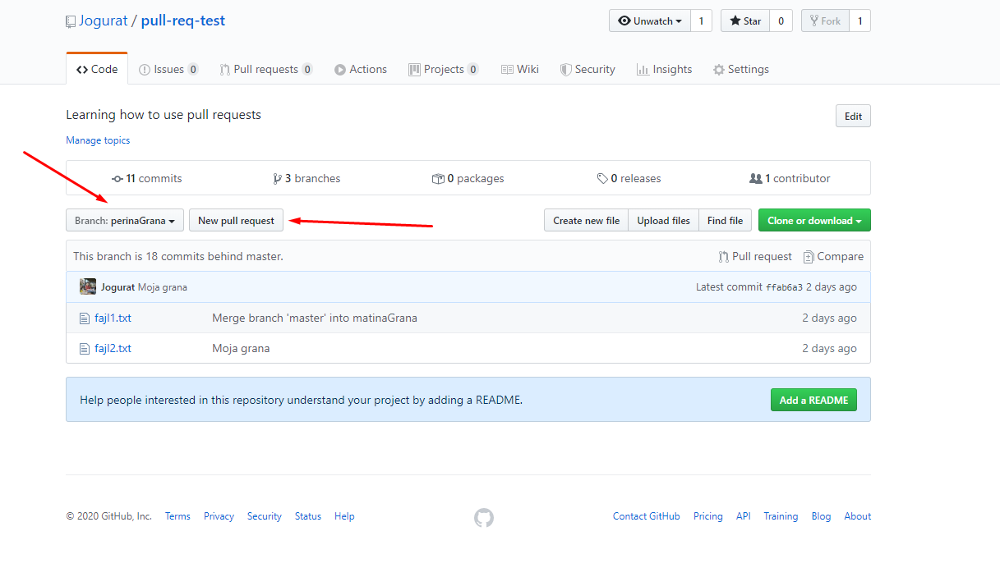

# Mali intro u git

Ovde cemo videti kako se koristi git :smile:

## Inicijalizacija lokalnog repozitorijuma

Kao pocetak bilo kog projekta, prvo zelimo da napravimo inicijalni repozitorijum (repo):

```bash
git init
```

Ovime smo napravili .git folder koji ce voditi racuna o verzionisanju naseg koda.

## Kloniranje vec postojeceg repo-a

Posto ja vec imam napravljen repo za projekat, ostatak tima ce zapravo samo klonirati taj repo kod sebe na komp. To se radi na sledeci nacin:

1. Napravite folder u kom zelite da se nalazi projekat
2. U tom folderu idete desni klik, "Git Bash Here"
3. Pokrenete sledecu komandu:

```bash
git clone <link-ka-repo> .
```

Konkretnije za nas projekat, ovo je tacna komanda:

```bash
git clone https://github.com/Jogurat/daljinac.git .
```

Tacka na kraju komande oznacava da zelite da se repo klonira u trenutni root folder, bez te tacke bi u folderu u kom se trenutno nalazite napravio jos jedan folder koji bi u ovom slucaju imao naziv "daljinac".

## Workflow dodavanja neke funkcionalnosti na kojoj ste vi radili

Generalno, idealno bi bilo da svako radi na svojoj grani. Jos idealnije bi bilo da svaki novi feature ili bug-fix ima svoju granu, ali to je za nase svrhe nepotrebno. Sada cemo videti kako se pravi grana, dodaju fajlovi na "stage" i commit-uju promene u kodu.

Za pravljenje nove grane, i prebacivanje na tu granu, koristimo sledecu komandu:

```bash
git checkout -b <ime-grane>
```

Sada, sve promene koje pravimo u kodu bice **samo na toj grani**. O tome kako da dodamo te promene na **master** granu, cemo kasnije.

Dalje, kada napravimo odredjene promene u kodu, zelimo da te promene "komitujemo". To se radi na sledeci nacin:

```bash
git add .
git commit -m "Moja poruka komita"
```

Prva komanda stage-uje _sve_ foldere i fajlove koji se nalaze u root folderu (folder u kom je otvoren Git Bash, tj. terminal). Izuzetno, ako postoji .gitignore fajl, ti fajlovi i folderi ce uvek biti izuzeti iz stage-a. Ako u .gitignore stoji folder "images", koliko god puta radili `git add .` taj folder nece biti stage-ovan.

Druga komanda komituje te promene uz dodatu poruku. Vodite racuna da te poruke budu smislene, npr. "Popravljen bug sa logovanjem". U ovom trenutku vase izmene su sacuvane uz poruku, i ako treba mogu se videti uz sve ostale izmene na vasoj grani.

Ove dve komande izvrsavamo svaki put kad napravimo neku promenu u kodu. Voditi racuna da su fajlovi zapravo sacuvani (Ctrl + S), u VS Code nesacuvani, a izmenjeni fajlovi imaju tackicu uz ime.

### Sada zelimo da sve izmene koje smo napravili, budu vidljive i na master grani (glavna grana)

Ovo cemo izvrsiti preko **Pull Request**-ova.

Kada smo odradili komandu `git clone ...` automatski je postavljena "grana" koja ima naziv **_origin_**. Sada zelimo da nasa licna grana bude na _remote_ repo-u (repozitorijum na serveru npr. Github-a). I to cemo postici sledecom komandom:

```bash
git push origin <ime-grane>
```

Ako sam pre izvrsio komandu `git checkout -b perinaGrana`, ova komanda ce izgledati:

```bash
git push origin perinaGrana
```

Ovime smo napravili novu granu na remote repo-u. Sada bi trebalo da napravimo novi **pull request**.


I to je to, vlasnik repozitorijuma ce onda prihvatiti ili odbiti taj pull request i vase izmene ce biti vidljive na master grani (ako su prihvacene naravno).

### Bitna napomena

U trenutku dok vi radite na "svom delu" koda, igrom slucaja mozda je neko pre vas izmenio isti taj deo, te moze doci do konflikta. Tako da je "pravilo" da pre _push_-ovanja svojih izmena jako bitno da se prvo sve izmene _pull_-uju kod sebe u lokal, rese bilo kakvi konflikti. Nakon sto se rese konflikti, moramo opet uraditi:

```bash
git add .
git commit -m "Poruka razresnja kolizije"
```

i ponovo uradi push i tek onda da se napravi pull request.

### Da sumiramo

Pre bilo kakvih izmena, npr. na pocetku "radnog dana" izvrsimo komandu:

```bash
git pull origin master
```

Ovime smo azurni trenutnoj verziji koda. (**Ovde je pretpostavka da je sve sto ste prethodnog dana radili vec na master grani!**)

Odradili ste posao za odredjeni feature ili bug-fix. Komande:

```bash
git add .
git commit -m "Razresio bug1"
```

Ovo odradite za svaki feature ili bug ponaosob. Ideja je da komitovi budu sto manji (razdeljeni na logicke celine poput feature-a ili bug-fixeva). Dalje, **opet** dovlacimo kod sebe u lokalnu granu, remote master, istom komandom kao "sa pocetka dana", tj.

```bash
git pull origin master
```

Ako je doslo do konflikata, razresimo ih kod sebe u lokalu (VS Code lepo pokaze gde je doslo do konflikta, i kako se razresava). Potrebno je opet odraditi:

```bash
git add .
git commit -m "Razresio konflikt"
```

**TEK SMO SAD SPREMNI DA POSALJEMO IZMENE NA REMOTE!**

```bash
git push origin <ime-grane>
```

Otici na link na Github-u i otvoriti novi **Pull request**.

Iiii to bi bilo to... :relieved:
